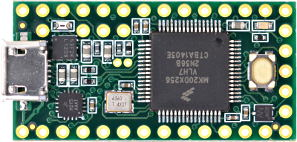
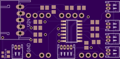
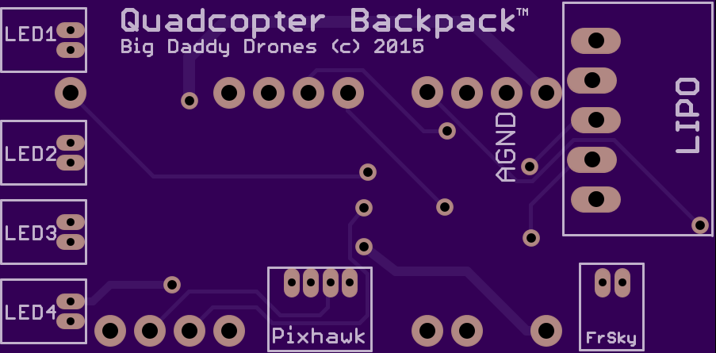
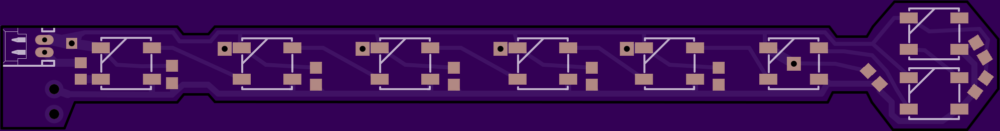
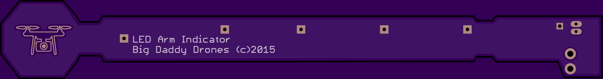

# Pixhawk Plus Circuit Boards #
This folder contains Eagle files for corresponding hardware. These boards are not required, but make the packaging neater than soldering a bunch of wires to a Teensy 3.2.

You can order your own, simply wire to the Teensy, or come up with your own creation.  See the Wiki for more options and ideas.

##Primary Board:##
This code and "backpack" are designed to work with [Teensy 3.2](https://www.pjrc.com/store/teensy32.html) development board.  Probably would world with Feather, or Arduino Mini, but I haven't tried that.

##Quadcopter Backpack:##

- Order from [OSHPark.com](https://oshpark.com/shared_projects/TG4BuGQ4) or [contact me](mailto:jim.rowe@gmail.com) for spare boards I may be willing to send you for nominal fee.
- BOM Parts for the Backpack: [From DigiKey](http://www.digikey.com/short/tvfnt3)

##LED Leg:##

- Order from [OSHPark.com](https://oshpark.com/shared_projects/HVTKyU7v) or [contact me](mailto:jim.rowe@gmail.com) for spare boards I may be willing to send you for nominal fee.
- You can also use Adafruit NeoPixel or other strips of WS2812b RGB LED lights found from many distributors.

<a href="https://oshpark.com/shared_projects/HVTKyU7v"> </a>

